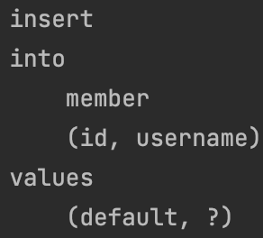
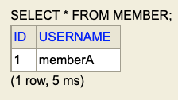

# 프로젝트 환경 설정

## 프로젝트 생성

- SpringBoot Version : 2.7.0
- build : gradle
- groupId : study
- artifactId : data_jpa
- dependencies
  - Spring Web
  - Spring Data Jpa
  - Lombok
  - -h2

## 스프링 부트 라이브러리 살펴보기

</br>

### 스프링 부트 라이브러리

</br>

- spring-boot-starter-web spring-boot-starter-tomcat: 톰캣 (웹서버)
- spring-webmvc: 스프링 웹 MVC
- spring-boot-starter-data-jpa
  - spring-boot-starter-aop
  - spring-boot-starter-jdbc
    - HikariCP 커넥션 풀 (부트 2.0 기본)
    - hibernate + JPA: 하이버네이트 + JPA
    - spring-data-jpa: 스프링 데이터 JPA
- spring-boot-starter(공통): 스프링 부트 + 스프링 코어 + 로깅
  - spring-boot
    - spring-core
  - spring-boot-starter-logging
    - logback, slf4j

</br>

### 테스트 라이브러리

</br>

- spring-boot-starter-test
  - junit: 테스트 프레임워크, 스프링 부트 2.2부터 junit5( jupiter ) 사용
    - 과거 버전은 vintage
  - mockito: 목 라이브러리
  - assertj: 테스트 코드를 좀 더 편하게 작성하게 도와주는 라이브러리
    - [assertJ](https://joel-costigliola.github.io/assertj/index.html)
  - spring-test: 스프링 통합 테스트 지원
- 핵심 라이브러리
  - 스프링 MVC
  - 스프링 ORM JPA, 하이버네이트
  - 스프링 데이터 JPA
- 기타 라이브러리
  - H2 데이터베이스 클라이언트
  - 커넥션 풀: 부트 기본은 HikariCP
  - 로깅 SLF4J & LogBack
  - 테스트

</br>

## 스프링 데이터 JPA와 DB 설정, 동작 확인

```yml
spring:
  datasource:
  #
  url: jdbc:h2:tcp://localhost/~/datajpa
  username: sa
  password:
  driver-class-name: org.h2.Driver
jpa:
  hibernate:
    ddl-auto: create
  properties:
    hibernate:
      show_sql: true
      format_sql: true
  logging.level:
    org.hibernate.SQL: debug
  #  org.hibernate.type: trace
```

- logging.level.org.hibernate.SQL: debug
  - 이게 로깅으로 찍는거
- logging.level.org.hibernate.type: trace
  - 파라미터 바인딩 해서 보여주는 거

</br>

```java
@Entity
@Getter
@NoArgsConstructor(access = AccessLevel.PROTECTED)
public class Member {

    @Id
    @GeneratedValue(strategy = GenerationType.IDENTITY)
    private Long id;
    private String username;

    public Member(String username) {
        this.username = username;
    }
}
```

</br>

```java
@Repository
public class MemberJpaRepository {

    @PersistenceContext
    private EntityManager em;

    public Member save(Member member){
        em.persist(member);
        return member;
    }

    public Member find(Long id){
        return em.find(Member.class, id);
    }

}
```

</br>

```java
@SpringBootTest
@Transactional
@Rollback(false)
class MemberJpaRepositoryTest {

    @Autowired
    MemberJpaRepository memberJpaRepository;

    @Test
    public void testMember(){
        Member member = new Member("memberA");

        Member savedMember = memberJpaRepository.save(member);
        Member findMember = memberJpaRepository.find(savedMember.getId());

        assertThat(findMember).isEqualTo(savedMember);

    }
}
```

</br>

> 우선 SpringData Jpa를 사용하지 않고 실행  
> @PersistenceContext를 통해서 EntityManager 사용  
> TestCode에서 객체 비교 테스트가 통과 하는 이유는  
> `당연히 같은 영속성 컨텍스트 내에서 엔티티 동일성을 보장해주니까!`

</br>

- h2 삽질

</br>

> 테스트 코드 짠거 쿼리 확인해보고 싶은데, 롤백돼서 확인 못했었는데 `@Rollback(false) 옵션을 false로 주면 된다.`

</br>

|                  결과 확인                  |
| :-----------------------------------------: |
|  |

</br>

|               h2 console 확인                |
| :------------------------------------------: |
|  |
