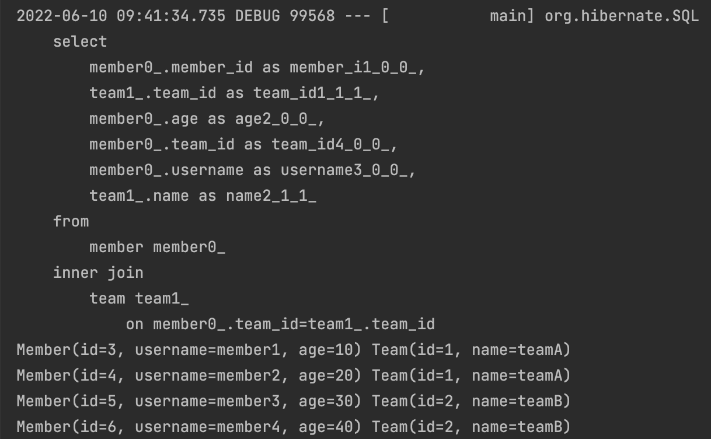
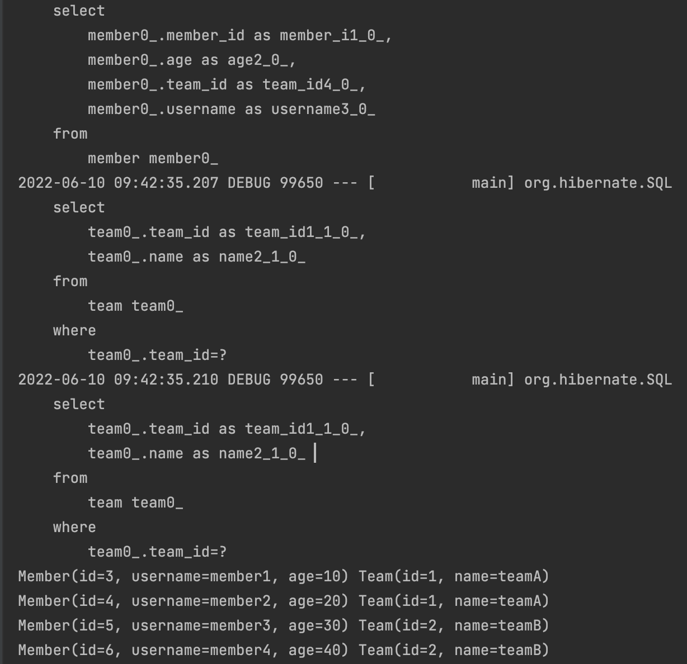

# 예제 도메인 모델

```java
@Entity
@Getter
@NoArgsConstructor(access = AccessLevel.PROTECTED)
@ToString(of = {"id", "username", "age"})
public class Member {

    @Id
    @GeneratedValue
    @Column(name = "MEMBER_ID")
    private Long id;

    private String username;

    private int age;

    @ManyToOne(fetch = FetchType.EAGER)
    @JoinColumn(name = "TEAM_ID")
    private Team team;

    @Builder
    public Member(String username, int age, Team team) {
        this.username = username;
        this.age = age;
        if (team != null) {
            changeTeam(team);
        }
    }

    public void changeTeam(Team team) {
        this.team = team;
        team.getMembers().add(this);
    }
}

```

</br>

```java
@Entity
@Getter
@NoArgsConstructor(access = AccessLevel.PROTECTED)
@ToString(of = {"id", "name"})
public class Team {

    @Id
    @GeneratedValue
    @Column(name = "TEAM_ID")
    private Long id;

    private String name;

    @OneToMany(mappedBy = "team")
    private List<Member> members = new ArrayList<>();

    public Team(String name) {
        this.name = name;
    }

}

```

</br>

```java
@SpringBootTest
@Transactional
@Rollback(false)
class MemberTest {

    @PersistenceContext
    EntityManager em;

    @Test
    public void testEntity(){
        Team teamA = new Team("teamA");
        Team teamB = new Team("teamB");

        em.persist(teamA);
        em.persist(teamB);

        Member member1 = new Member("member1", 10,teamA);
        Member member2 = new Member("member2", 20, teamA);
        Member member3 = new Member("member3", 30, teamB);
        Member member4 = new Member("member4", 40, teamB);

        em.persist(member1);
        em.persist(member2);
        em.persist(member3);
        em.persist(member4);

        em.flush();
        em.clear();

        //확인
        List<Member> members = em.createQuery("select m from Member m join fetch m.team", Member.class)
                .getResultList();

        members.forEach(
          member -> {
              System.out.println(member + " " + member.getTeam());
          }
        );

    }
}
```

|                 결과 확인                  |
| :----------------------------------------: |
|  |

</br>

```java
// no fetch join
List<Member> members = em.createQuery("select m from Member m", Member.class)
```

|            fetch join 안쓸 경우            |
| :----------------------------------------: |
|  |

</br>

> fetch Type을 Eager로 걸더라도 Member의 정보를 불러들이고나서 team의 정보를 불러들이는 것을 확인할 수 있다.  
> fetch join을 쓸 경우 select 쿼리 한 방에 불러들여오는 것을 확인할 수 있다.
