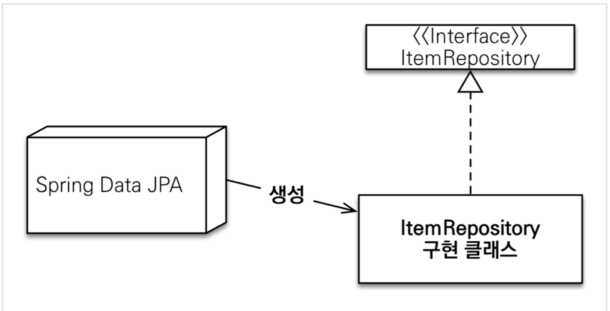
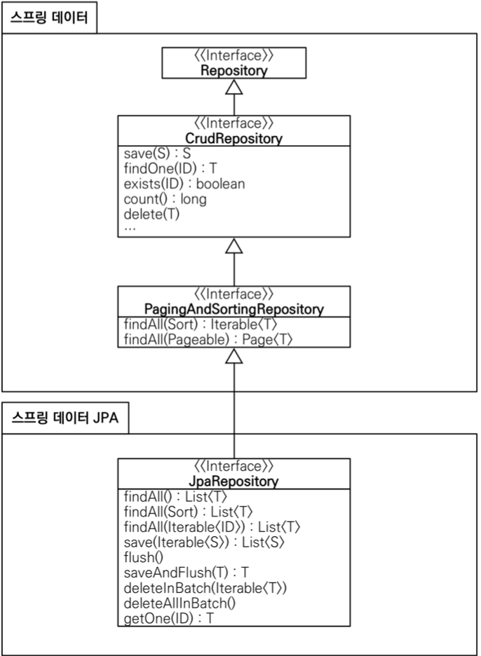

# 공통 인터페이스 기능

## 순수 JPA 기반 레포지토리 만들기

</br>

```java

@Repository
public class MemberJpaRepository {

    @PersistenceContext
    private EntityManager em;

    public Member save(Member member){
        em.persist(member);
        return member;
    }

    public void delete(Member member){
        em.remove(member);
    }

    public Member find(Long id){
        return em.find(Member.class, id);
    }

    public Optional<Member> findById(Long id){
        Member member = em.find(Member.class,id);
        return Optional.ofNullable(member);
    }

    public List<Member> findAll(){
        return em.createQuery("select m from Member m", Member.class)
                .getResultList();
    }

    public long count(){
        return em.createQuery("select count(m) from Member m", Long.class)
                .getSingleResult();
    }

}

```

```java

@Repository
public class TeamJpaRepository {

    @PersistenceContext
    EntityManager em;

    public Team save(Team team){
        em.persist(team);
        return team;
    }

    public void delete(Team team){
        em.remove(team);
    }

    public Team find(Long id){
        return em.find(Team.class, id);
    }

    public Optional<Team> findById(Long id){
        Team team = em.find(Team.class,id);
        return Optional.ofNullable(team);
    }

    public List<Team> findAll(){
        return em.createQuery("select t from Team t", Team.class)
                .getResultList();
    }

    public long count(){
        return em.createQuery("select count(Team) from Team t", Long.class)
                .getSingleResult();
    }
}

```

- TEST

```java

@SpringBootTest
@Transactional
@Rollback(false)
class MemberJpaRepositoryTest {

    @Autowired
    MemberJpaRepository memberJpaRepository;

    @Test
    public void testMember(){
        Member member = new Member("memberA",20,null);

        Member savedMember = memberJpaRepository.save(member);
        Member findMember = memberJpaRepository.find(savedMember.getId());

        assertThat(findMember).isEqualTo(savedMember);

    }

    @Test
    public void basicCRUD(){
        Member member1 = new Member("member1",20,null);
        Member member2 = new Member("member2",20,null);

        memberJpaRepository.save(member1);
        memberJpaRepository.save(member2);

        // 단건 조회
        Member findMember1 = memberJpaRepository.findById(member1.getId()).get();
        Member findMember2 = memberJpaRepository.findById(member2.getId()).get();

        assertThat(findMember1).isEqualTo(member1);
        assertThat(findMember2).isEqualTo(member2);

        // 리스트 조회 검증
        List<Member> memberList = memberJpaRepository.findAll();
        assertThat(memberList.size()).isEqualTo(2);

        // count 검증
        assertThat(memberJpaRepository.count()).isEqualTo(2);

        // 삭제 검증
        memberJpaRepository.delete(member1);
        memberJpaRepository.delete(member2);

        assertThat(memberJpaRepository.count()).isEqualTo(0);
    }
}

```

</br>

## 공통 인터페이스 설정

</br>

- 인터페이스로 정의된 memberRepository의 정체는?

```java
System.out.println(memberRepository.getClass());
```

```text
class jdk.proxy2.$Proxy114
```

</br>

> MemberRepository의 구현체는 개발자가 아닌 Spring Data Jpa가 넣어주어  
> 인젝션을 해준 것.

</br>

|       Spring Data Jpa가 구현 클래스 대신 구현       |
| :-------------------------------------------------: |
|  |

</br>

- @Repository 어노테이션 생략 가능한 이유
  - 컴포넌트 스캔을 스프링 데이터 JPA가 자동으로 처리
  - JPA 예외를 스프링 예외로 변환하는 과정도 자동으로 처리

</br>

## 공통 인터페이스 적용

</br>

```java
@NoRepositoryBean
public interface JpaRepository<T, ID> extends PagingAndSortingRepository<T, ID>, QueryByExampleExecutor<T>

public interface MemberRepository extends JpaRepository<Member, Long>
```

> 제네릭의 첫번째 타입은 Entity 타입  
> 두번째는 식별자 래퍼클래스

</br>

## 공통 인터페이스 분석

</br>

- JpaRepository
  - org.springfraework.data:spring-data-jpa
- PagingAndSortingRepository
  - org.springfraework.data:spring-data:commons
- CrudRepository
- Repository

</br>

|                  공통 인터페이스 구성                   |
| :-----------------------------------------------------: |
|  |

</br>
