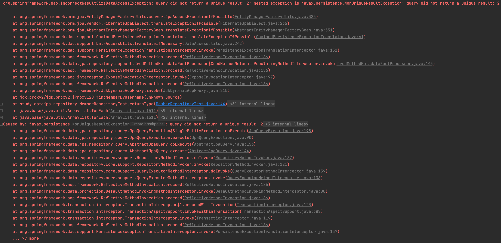
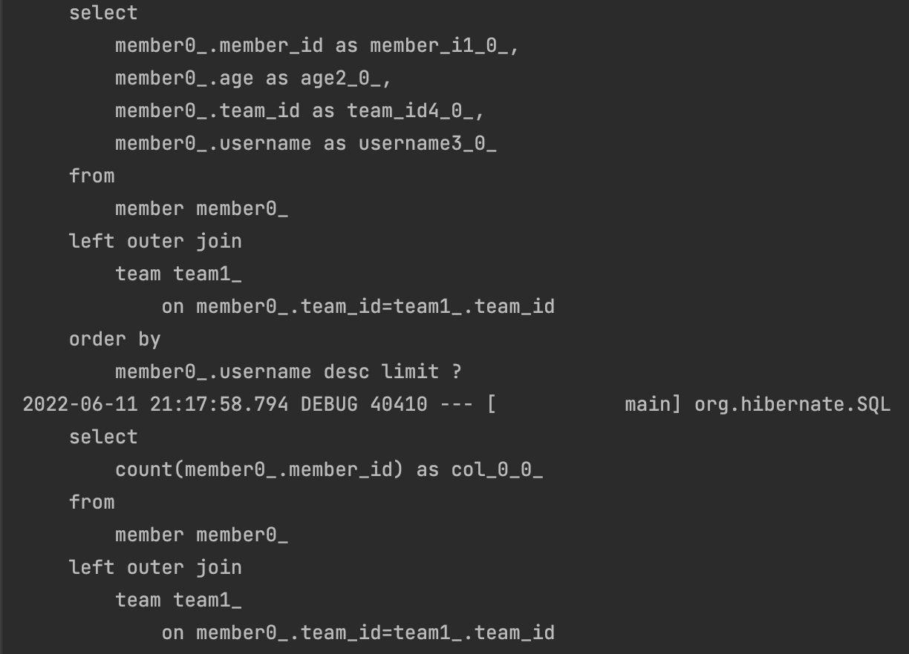
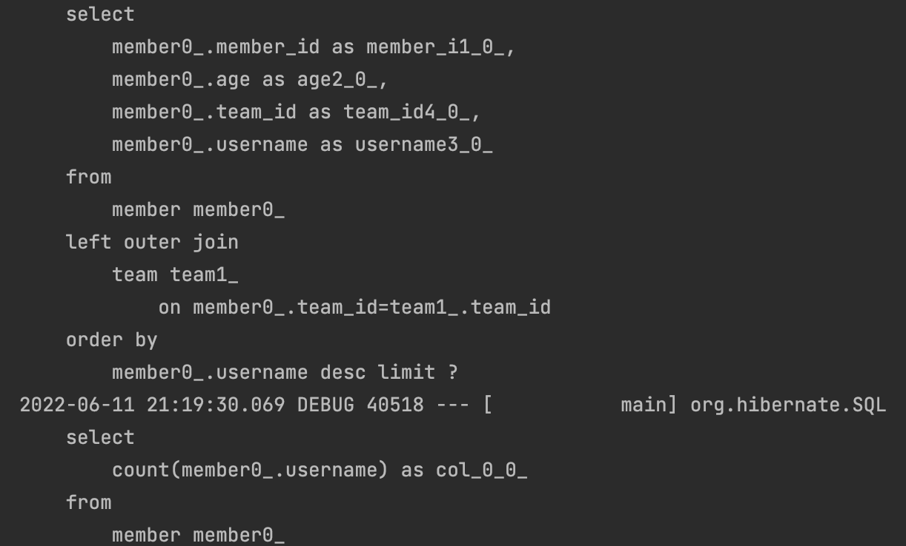
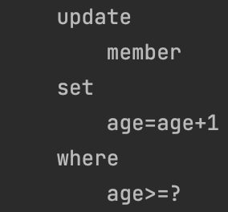
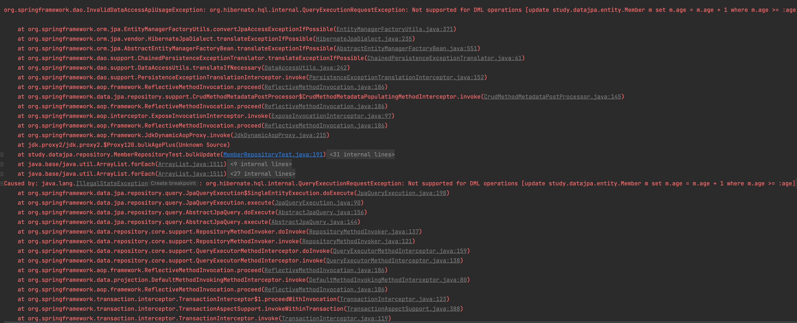
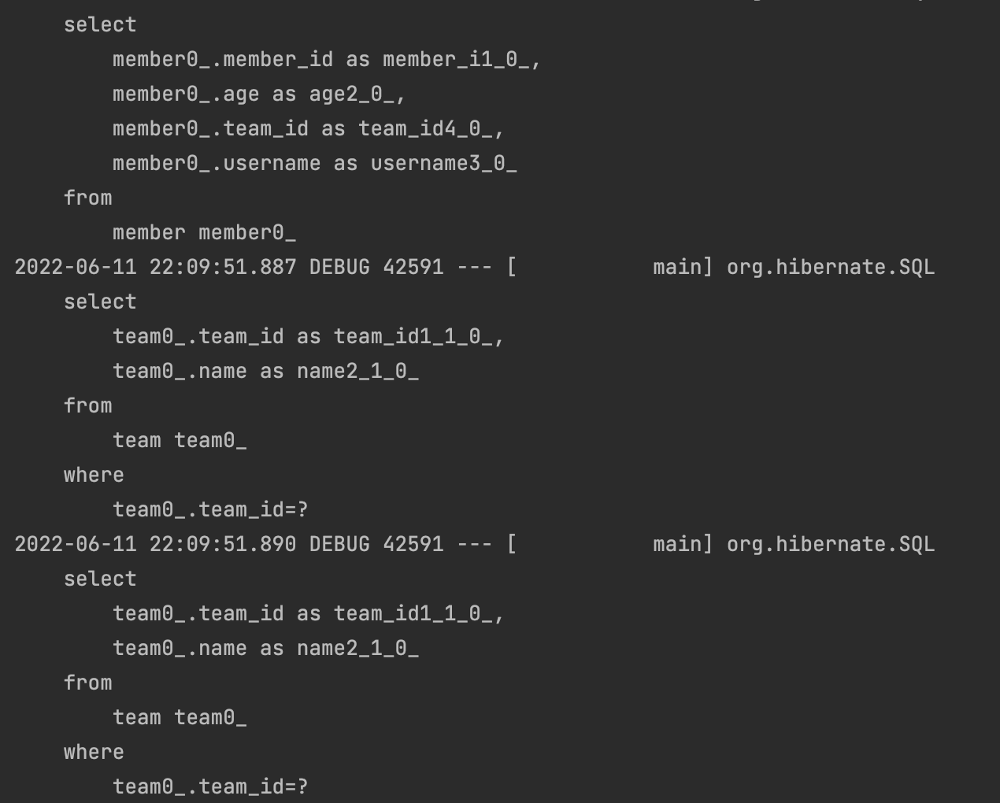
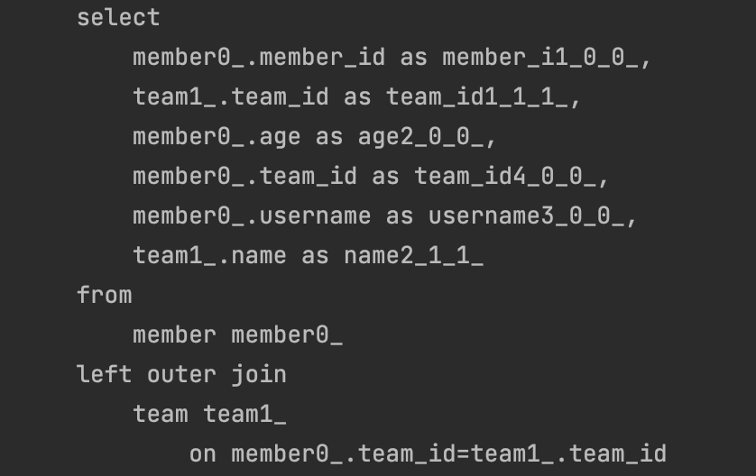
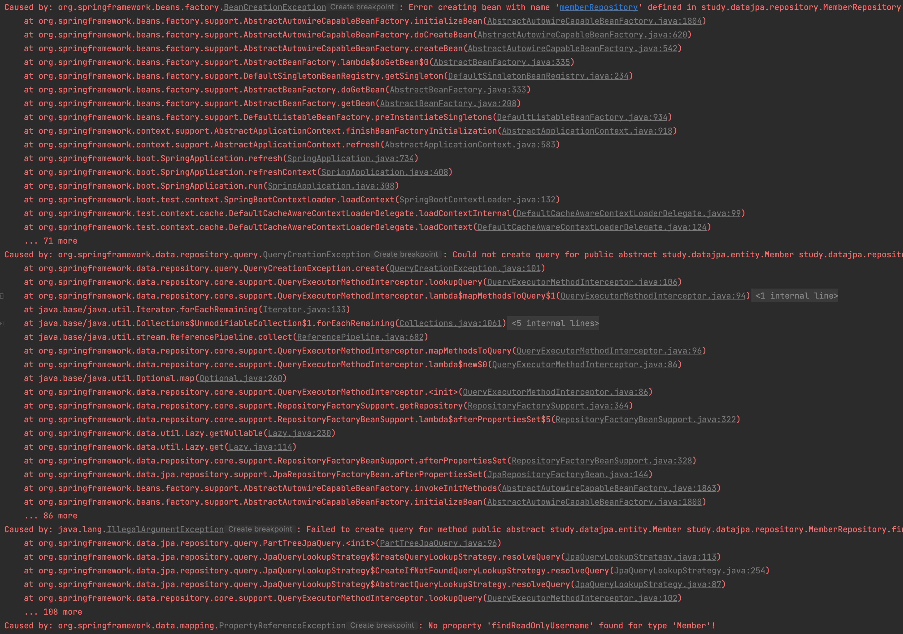
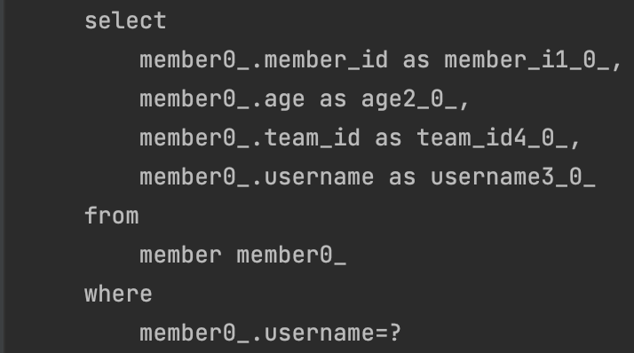
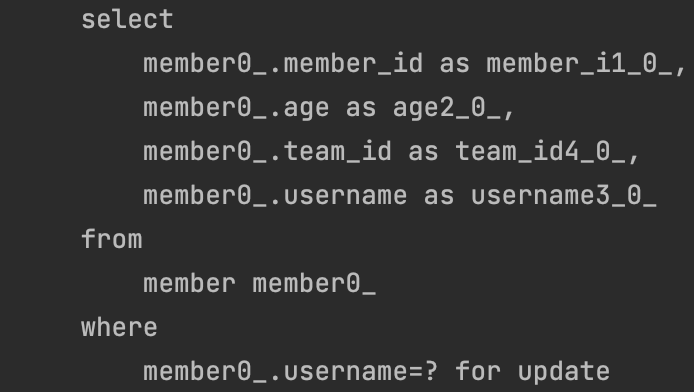

# 쿼리 메소드 기능

## 메소드 이름으로 쿼리 생성

</br>

- 쿼리 메소드 기능
  - 메소드 이름으로 쿼리 생성
  - 메소드 이름으로 JPA NamedQueyr 호출
  - @Query 어노테이션을 사용해서 리포지토리 인터페이스에 쿼리 직접정의

</br>

- 실제 순수 JPA를 통해 만든 메서드

```java
public List<Member> findByUsernameAndAgeGreaterThen(String username, int age){
        return em.createQuery("select m from Member m where m.username = :username and m.age > :age")
                .setParameter("username",username)
                .setParameter("age",age)
                .getResultList();
    }
```

```java
@Test
    public void findByUsernameAndAgeGreaterThen(){
        Member m1 = new Member("aaa", 10, null);
        Member m2 = new Member("aaa", 10, null);
        memberJpaRepository.save(m1);
        memberJpaRepository.save(m2);

        List<Member> members = memberJpaRepository.findByUsernameAndAgeGreaterThen("aaa", 5);

        assertThat(members.size()).isEqualTo(2);
    }

```

> 그런데 Spring Data Jpa에서 쿼리를 만들기 위해 이렇게  
> 상속 받은 후 메서드를 만들 수 있는가?

</br>

```java
    List<Member> findByUsernameAndAgeGreaterThan(String username, int age);
```

</br>

> Spring data JPA가 프로퍼티에 맞춰서 JPQL을 만들어준다.

</br>

- 조회: find...By ,read...By ,query...By get...By,
- COUNT: count...By 반환타입 long
- EXISTS: exists...By 반환타입 boolean
- 삭제: delete...By, remove...By 반환타입 long
- DISTINCT: findDistinct, findMemberDistinctBy
- LIMIT: findFirst3, findFirst, findTop, findTop3

## JPA NamedQuery

</br>

```java
@NamedQuery(
        name = "Member.findByUsername",
        query = "select m from Member m where m.username = :username"
)
public class Member {
}
```

```java
// @Query(name = "Member.findByUsername")
    List<Member> findByUsername(@Param("username") String username);
```

</br>

> 실제로 Repository에서 정의된 Named query를 이렇게 사용하면 된다.  
> 쿼리 어노테이션이 없어도 동작을 하는 이유는  
> 메서드 명을 통해서 NamedQuery를 먼저 찾기 때문이다.  
> `즉, 명칭을 같게 만들면 안써도 동작한다!`

</br>

## @Query, 레포지토리 메소드에 쿼리 정의하기

</br>

```java
@Query("select m from Member m where m.username = :username and m.age = :age")
public List<Member> findUser(@Param("username")String username, @Param("age") int age);

```

```java
@Test
    public void testQuery(){
        Member m1 = new Member("aaa", 10, null);
        Member m2 = new Member("aaa", 10, null);

        memberRepository.save(m1);
        memberRepository.save(m2);

        List<Member> members = memberRepository.findUser("aaa",10);

        AssertionsForClassTypes.assertThat(members.size()).isEqualTo(2);

    }
```

</br>

- 실행할 메서드에 정적 쿼리를 직접 작성하여 이름 없는 NamedQuery라 할 수 있다.
- JPA Named 쿼리 처럼 애플리케이션 실행 시점에 문법 오류를 발견 할 수 있다.
- 메서드 이름을 스프링이 지원해준다 하여도 `파라미터가 증가할 수록 이름이 길어진다`
  - @Query 좋아!

</br>

## @Query, 값, DTO 조회하기

</br>

```java
 @Query("select m.username from Member m")
    public List<String> findUsernameList();

@Test
    public void testUsername(){
        Member m1 = new Member("aaa", 10, null);
        Member m2 = new Member("aaa", 10, null);

        memberRepository.save(m1);
        memberRepository.save(m2);

        List<String> usernameList = memberRepository.findUsernameList();

        usernameList.forEach(System.out::println);
    }
```

</br>

- 그러면 DTO는?

```java
@Query("select new study.datajpa.dto.MemberDto(m.id, m.username, t.name)from Member m join m.team t")
List<MemberDto> findMemberDto();
```

</br>

> package 정보를 모두 입력해야하는 번거로움..

</br>

## 파라미터 바인딩

</br>

- 위치기반(나도 안씀.)
- 이름기반

</br>

- 컬렉션 파라미터 바인딩
  - 실제로 where in 절을 사용할 때 사용할 일이 있지않을까~

```java
    @Query("select m from Member m where m.username in :names")
    List<Member> findByNames(@Param("names") List<String> names);
```

```java
    @Test
    public void findByNames(){
        Team team1 = new Team("teamA");

        Member m1 = new Member("aaa", 10, team1);
        Member m2 = new Member("bbb", 20, team1);

        teamRepository.save(team1);

        memberRepository.save(m1);
        memberRepository.save(m2);

        List<Member> memberList = memberRepository.findByNames(Arrays.asList("aaa","bbb"));

        assertThat(memberList.size()).isEqualTo(2);
    }

```

</br>

## 반환 타입

</br>

```java

    List<Member> findListByUsername(String username); //컬렉션

    Member findMemberByUsername(String username); // 단건

    Optional<Member> findOptionalByUsername(String username); // Optional

```

</br>

- nullable일 경우 Optional로 의도해서 작성해야한다.
- Entity가 unique하지 않을 경우 단건 조회는 Exception이 터질 수 있음으로 List 조회 해라

</br>

```java

@Test
    public void returnType(){
        Team team1 = new Team("teamA");

        Member m1 = new Member("aaa", 10, team1);
        Member m2 = new Member("aaa", 20, team1);

        teamRepository.save(team1);

        memberRepository.save(m1);
        memberRepository.save(m2);

        Member aaa1 = memberRepository.findMemberByUsername("aaa");

    }

```

|       no unique를 단건 조회 하면        |
| :-------------------------------------: |
|  |

</br>

> 원래 터진 Exception은 NonUniqueResultException이 터지면  
> Spring data jpa는 Springframework Exception으로 바꿔서 반환해준다.

</br>

## 순수 JPA 페이징과 정렬

</br>

- 검색 조건: 나이가 10살
- 정렬 조건: 이름으로 내림차순
- 페이징 조건: 첫 번째 페이지, 페이지당 보여줄 데이터는 3건

</br>

```java
    public List<Member> findByPage(int age, int offset, int limit){
        return em.createQuery("select m from Member  m where m.age = :age order by m.username desc")
                .setParameter("age", age)
                .setFirstResult(offset)
                .setMaxResults(limit)
                .getResultList();

    }

    public long totalCount(int age){
        return em.createQuery("select count(m) from Member m where m.age = :age", Long.class)
                .setParameter("age",age)
                .getSingleResult();
    }
```

```java
    @Test
    public void paging() throws Exception {

        memberJpaRepository.save(new Member("member1", 10, null));
        memberJpaRepository.save(new Member("member2", 10, null));
        memberJpaRepository.save(new Member("member3", 10, null));
        memberJpaRepository.save(new Member("member4", 10, null));
        memberJpaRepository.save(new Member("member5", 10, null));

        int age = 10;
        int offset = 0;
        int limit = 3;

        List<Member> members = memberJpaRepository.findByPage(age, offset, limit);
        long totalCount = memberJpaRepository.totalCount(age);

        assertThat(members.size()).isEqualTo(3);

        assertThat(totalCount).isEqualTo(5);
    }
```

</br>

## 스프링 데이터 JPA 페이징과 정렬

</br>

- 페이징과 정렬 파라미터

  - org.springframework.data.domain.Sort : 정렬 기능
  - org.springframework.data.domain.Pageable : 페이징 기능 (내부에 Sort 포함)

- 특별한 반환 타입
  - org.springframework.data.domain.Page : 추가 count 쿼리 결과를 포함하는 페이징
  - org.springframework.data.domain.Slice : 추가 count 쿼리 없이 다음 페이지만 확인 가능 (내부적으로 limit + 1조회)
  - List (자바 컬렉션): 추가 count 쿼리 없이 결과만 반환

</br>

> 와.. shift + F6 누르면 한 번에 해당 키워드 수정 가능하네...

</br>

```java

@Test
    public void paging() throws Exception {

        memberRepository.save(new Member("member1", 10, null));
        memberRepository.save(new Member("member2", 10, null));
        memberRepository.save(new Member("member3", 10, null));
        memberRepository.save(new Member("member4", 10, null));
        memberRepository.save(new Member("member5", 10, null));

        int age = 10;
        PageRequest pageRequest = PageRequest.of(0,3, Sort.by(Sort.Direction.DESC, "username"));

        Page<Member> page = memberRepository.findByAge(age, pageRequest);

        //page에 있는 실제 content
        List<Member> content = page.getContent();

        long totalElements = page.getTotalElements();

        content.forEach(System.out::println);

        System.out.println(totalElements);

        assertThat(content.size()).isEqualTo(3); // 실제 컨텐트 개수
        assertThat(page.getTotalElements()).isEqualTo(5); // 총 컨텐트의 개수
        assertThat(page.getNumber()).isEqualTo(0); // 페이지가 몇번인지
        assertThat(page.getTotalPages()).isEqualTo(2); // 전체 페이지가 2인지. -> 5개를 사이즈가 3인페이지니까 3 + 2 2개 나온다
        assertThat(page.isFirst()).isTrue(); // 첫번째인지.
        assertThat(page.hasNext()).isTrue(); // 다음페이지가 있는지
    }

```

</br>

- 페이지 반환 타입을 Slice로 바꾸면

</br>

```java

    @Test
    public void paging() throws Exception {

        memberRepository.save(new Member("member1", 10, null));
        memberRepository.save(new Member("member2", 10, null));
        memberRepository.save(new Member("member3", 10, null));
        memberRepository.save(new Member("member4", 10, null));
        memberRepository.save(new Member("member5", 10, null));

        int age = 10;
        PageRequest pageRequest = PageRequest.of(0,3, Sort.by(Sort.Direction.DESC, "username"));

        Slice<Member> page = memberRepository.findByAge(age, pageRequest);
        //page에 있는 실제 content
        List<Member> content = page.getContent();

//        long totalElements = page.getTotalElements();

        content.forEach(System.out::println);

//        System.out.println(totalElements);

        assertThat(content.size()).isEqualTo(3); // 실제 컨텐트 개수
//        assertThat(page.getTotalElements()).isEqualTo(5); // 총 컨텐트의 개수
        assertThat(page.getNumber()).isEqualTo(0); // 페이지가 몇번인지
//        assertThat(page.getTotalPages()).isEqualTo(2); // 전체 페이지가 2인지. -> 5개를 사이즈가 3인페이지니까 3 + 2 2개 나온다
        assertThat(page.isFirst()).isTrue(); // 첫번째인지.
        assertThat(page.hasNext()).isTrue(); // 다음페이지가 있는지
    }

```

</br>

> Total에 대한 쿼리를 날리지 않아서 주석처리된 메서드들 실행 불가  
> `...더보기`와 같은 기능들 수행할때 좋음

</br>

```java
@Query(value = "select m from Member m left join m.team t")
    Page<Member> findByAge(int age, Pageable pageable);
```

| page 쿼리하면 count도 join 연산 후 실행 |
| :-------------------------------------: |
|       |

</br>

- count 쿼리를 분리 하기

```java
    @Query(value = "select m from Member m",
            countQuery = "select count(m.username) from Member m")
    Page<Member> findByAge(int age, Pageable pageable);
```

</br>

|         count 쿼리 시 join 미연산          |
| :----------------------------------------: |
|  |

</br>

> paging 처리를 할 때 항상 성능 문제를 고려하라.  
> `TODO: Pageable, Page, Slice 인터페이스 구조 확인하기`

</br>

- 당연히 페이지 조회한 그대로 front 서버로 넘겨주면 안되다.
  - DB와 연결되는 Entity를 presentation layer까지 끌고간다?
  - 그거를 Response로 넘겨준다?
  - 추후 Api 명세가 변경될 때 Entity의 변화는?
  - 당연히 Dto

</br>

- Page에 map 기능이 있다.

</br>

```java

	/**
	 * Returns a new {@link Page} with the content of the current one mapped by the given {@link Function}.
	 *
	 * @param converter must not be {@literal null}.
	 * @return a new {@link Page} with the content of the current one mapped by the given {@link Function}.
	 * @since 1.10
	 */
	<U> Page<U> map(Function<? super T, ? extends U> converter);

```

</br>

```java
@Getter
@ToString
public class MemberDto {

    private Long id;
    private String username;
    private String teamName;

    public MemberDto(Long id, String username, String teamName) {
        this.id = id;
        this.username = username;
        this.teamName = teamName;
    }

    public static MemberDto of(Member member){
        return new MemberDto(
                member.getId(),
                member.getUsername(),
                member.getTeam().getName()
        );
    }
}

```

```java
 Page<MemberDto> map = page.map(MemberDto::of);
```

</br>

> 나는 reference로 사용하는 것을 선호하는 편...

</br>

## 벌크성 수정 쿼리

</br>

- 순수 JPA

```java
public int bulkAgePlus(int age){
        return em.createQuery("update Member m set m.age = m.age + 1 where  m.age >=: age")
                .setParameter("age" , age)
                .executeUpdate();
    }
```

</br>

```java

 @Test
    public void bulkUpdate(){
        memberJpaRepository.save(new Member("member1", 10, null));
        memberJpaRepository.save(new Member("member2", 19, null));
        memberJpaRepository.save(new Member("member3", 20, null));
        memberJpaRepository.save(new Member("member4", 21, null));
        memberJpaRepository.save(new Member("member5", 40, null));

        int resultCount = memberJpaRepository.bulkAgePlus(20);

        assertThat(resultCount).isEqualTo(3);
    }

```

</br>

|                   bulk 연산 결과                   |
| :------------------------------------------------: |
|  |

</br>

> 업데이트는 3개의 row에서 발생했지만  
> 쿼리는 한 개를 통해 update됨을 알 수 있다.

</br>

- 스프링 데이터 JPA

```java
@Query("update Member m set m.age = m.age + 1 where m.age >= :age")
    int bulkAgePlus(@Param("age") int age);
```

```java
@Test
    public void bulkUpdate(){
        memberRepository.save(new Member("member1", 10, null));
        memberRepository.save(new Member("member2", 19, null));
        memberRepository.save(new Member("member3", 20, null));
        memberRepository.save(new Member("member4", 21, null));
        memberRepository.save(new Member("member5", 40, null));

        int resultCount = memberRepository.bulkAgePlus(20);

        assertThat(resultCount).isEqualTo(3);
    }
```

|예외 발생|
||

</br>

- @Modifying 안붙이면 exception 터지는 이유

> jpql에서는 executeUpdate를 통해 update 및 delete와 같은 수정 쿼리를 감지한다.  
> 그런데 SpringData Jpa에서는 @Modifying을 통해 이 기능을 통해 쿼리를 수행하기 때문에  
> 어노테이션을 붙이지 않으면 exception이 터진다.

</br>

```java
package org.springframework.data.jpa.repository;

import java.lang.annotation.Documented;
import java.lang.annotation.ElementType;
import java.lang.annotation.Retention;
import java.lang.annotation.RetentionPolicy;
import java.lang.annotation.Target;

/**
 * <p>
 * Indicates a query method should be considered as modifying query as that changes the way it needs to be executed.
 * This annotation is only considered if used on query methods defined through a {@link Query} annotation. It's not
 * applied on custom implementation methods or queries derived from the method name as they already have control over
 * the underlying data access APIs or specify if they are modifying by their name.
 * </p>
 * <p>
 * Queries that require a `@Modifying` annotation include {@code INSERT}, {@code UPDATE}, {@code DELETE}, and DDL
 * statements.
 * </p>
 *
 * @author Oliver Gierke
 * @author Christoph Strobl
 * @author Nicolas Cirigliano
 * @author Jens Schauder
 * @see Query
 */
@Retention(RetentionPolicy.RUNTIME)
@Target({ ElementType.METHOD, ElementType.ANNOTATION_TYPE })
@Documented
public @interface Modifying {

	/**
	 * Defines whether we should flush the underlying persistence context before executing the modifying query.
	 *
	 * @return
	 */
	boolean flushAutomatically() default false;

	/**
	 * Defines whether we should clear the underlying persistence context after executing the modifying query.
	 *
	 * @return
	 */
	boolean clearAutomatically() default false;
}

```

</br>

- 아주 친절하게 잘 적혀있다. 대충 해석해보면
  - 해당 어노테이션은 @Query 어노테이션이 붙은 메서드에 사용될 것을 고려해야하고
  - INSERT, UPDATE, DELETE 와 DDL statements를 요구하는 쿼리들에 필요하다.

</br>

- flushAutomatically

> 벌크성 연산을 시행하기 이전에 영속성 컨텍스트를 flush 할 것인지.

- ClearAutomatically에 대해 살펴보자.

> 벌크성 연산 후에 영속성 컨텍스트를 clear 할 것인지.

</br>

> JPA를 공부해보신분들은 아시겠지만 JPA를 사용할 경우  
> 벌크성 연산이 될 때 flush를 진행하고 clear를 실행해주지 않으면  
> 데이터 정합성을 지킬 수 없다.
> 위의 옵션을 잘 이해하자!

</br>

```java
@Modifying(clearAutomatically = false)
    @Query("update Member m set m.age = m.age + 1 where m.age >= :age")
    int bulkAgePlus(@Param("age") int age);
```

```java
    @Test
    public void bulkUpdate(){
        memberRepository.save(new Member("member1", 10, null));
        memberRepository.save(new Member("member2", 19, null));
        memberRepository.save(new Member("member3", 20, null));
        memberRepository.save(new Member("member4", 21, null));
        memberRepository.save(new Member("member5", 40, null));

        int resultCount = memberRepository.bulkAgePlus(20);

        // this
        System.out.println(memberRepository.findByUsername("member5").get(0).getAge());

        assertThat(resultCount).isEqualTo(3);
    }
```

> 주석 처리 된 곳에 this를 보면  
> bulkAgePlus를 통해 flush가 실행 되어 DB에 update 연산이 이뤄진다.  
> 하지만 영속성 컨텍스트에 member5의 나이는 41이 아닌 40으로  
> 데이터 정합성이 어긋나게 된다.

</br>

- 위의 사항을 지키기 위해서

```java
@Modifying(clearAutomatically = true)
    @Query("update Member m set m.age = m.age + 1 where m.age >= :age")
    int bulkAgePlus(@Param("age") int age);
```

</br>

> clearAutomatically를 true로 설정해야한다.

</br>

## @EntityGraph

</br>

- 연관된 엔티티들을 SQL 한 번에 조회하는 방법

> member -> team이 지연로딩 관계이고, 다음과 같이 team의 데이터를 조회할 때마다 쿼리가 실행된다.

</br>

|                Member Lazy                |
| :---------------------------------------: |
|  |

</br>

- Member List 전제 조회 한 번
- 반복문을 통해서 team을 사용할 때마다 쿼리가 발생...

</br>

- @Query 어노테이션을 통한 JPQL로 fetch join

```java
@Query("select m from Member m left join fetch m.team")
    List<Member> findMemberFetchJoin();
```

```java
    @Test
    public void findFetch(){
        Team teamA = new Team("teamA");
        Team teamB = new Team("teamB");

        teamRepository.save(teamA);
        teamRepository.save(teamB);

        memberRepository.save(new Member("member1", 10, teamA));
        memberRepository.save(new Member("member2", 20, teamA));

        em.flush();
        em.clear();

        List<Member> members = memberRepository.findMemberFetchJoin();

        for(Member member : members){
            member.getTeam().getName();
        }
    }
```

|                 FetchJoin                 |
| :---------------------------------------: |
|  |

</br>

> 연관관계가 있는 객체들을 조인하여 한 번에 끌고 오는 것

</br>

- @EntityGraph

```java
package org.springframework.data.jpa.repository;

import java.lang.annotation.Documented;
import java.lang.annotation.ElementType;
import java.lang.annotation.Retention;
import java.lang.annotation.RetentionPolicy;
import java.lang.annotation.Target;

import org.springframework.data.jpa.repository.query.JpaQueryMethod;

/**
 * Annotation to configure the JPA 2.1 {@link javax.persistence.EntityGraph}s that should be used on repository methods.
 * Since 1.9 we support the definition of dynamic {@link EntityGraph}s by allowing to customize the fetch-graph via
 * {@link #attributePaths()} ad-hoc fetch-graph configuration.
 *
 * If {@link #attributePaths()} are specified then we ignore the entity-graph name {@link #value()} and treat this
 * {@link EntityGraph} as dynamic.
 *
 * @author Christoph Strobl
 * @author Thomas Darimont
 * @author Oerd Cukalla
 * @since 1.6
 */
@Retention(RetentionPolicy.RUNTIME)
@Target({ ElementType.METHOD, ElementType.ANNOTATION_TYPE })
@Documented
public @interface EntityGraph {

	/**
	 * The name of the EntityGraph to use. If empty we fall-back to {@link JpaQueryMethod#getNamedQueryName()} as the
	 * value.
	 *
	 * @return
	 */
	String value() default "";

	/**
	 * The {@link EntityGraphType} of the EntityGraph to use, defaults to {@link EntityGraphType#FETCH}.
	 *
	 * @return
	 */
	EntityGraphType type() default EntityGraphType.FETCH;

	/**
	 * The paths of attributes of this {@link EntityGraph} to use, empty by default. You can refer to direct properties of
	 * the entity or nested properties via a {@code property.nestedProperty}.
	 *
	 * @return
	 * @since 1.9
	 */
	String[] attributePaths() default {};

	/**
	 * Enum for JPA 2.1 {@link javax.persistence.EntityGraph} types.
	 *
	 * @author Thomas Darimont
	 * @since 1.6
	 */
	public enum EntityGraphType {

		/**
		 * When the javax.persistence.loadgraph property is used to specify an entity graph, attributes that are specified
		 * by attribute nodes of the entity graph are treated as FetchType.EAGER and attributes that are not specified are
		 * treated according to their specified or default FetchType.
		 *
		 * @see <a href="https://download.oracle.com/otn-pub/jcp/persistence-2_1-fr-eval-spec/JavaPersistence.pdf">JPA 2.1
		 *      Specification: 3.7.4.2 Load Graph Semantics</a>
		 */
		LOAD("javax.persistence.loadgraph"),

		/**
		 * When the javax.persistence.fetchgraph property is used to specify an entity graph, attributes that are specified
		 * by attribute nodes of the entity graph are treated as FetchType.EAGER and attributes that are not specified are
		 * treated as FetchType.LAZY
		 *
		 * @see <a href="https://download.oracle.com/otn-pub/jcp/persistence-2_1-fr-eval-spec/JavaPersistence.pdf">JPA 2.1
		 *      Specification: 3.7.4.1 Fetch Graph Semantics</a>
		 */
		FETCH("javax.persistence.fetchgraph");

		private final String key;

		private EntityGraphType(String value) {
			this.key = value;
		}

		public String getKey() {
			return key;
		}
	}
}


```

</br>

```java

    @EntityGraph(attributePaths = {"team"})
    List<Member> findAll();

    @EntityGraph(attributePaths = {"team"})
    @Query("select m from Member m")
    List<Member> findMemberEntityGraph();

    @EntityGraph(attributePaths = {"team"})
    List<Member> findByUsername(String username);

```

</br>

> EntityGraph를 통해 JPQL을 직접 작성하지 않고도 연관된 객체를  
> 지연 로딩 없이 불러올 수도 있다.
> `attributePaths option은 연관관계를 맺고 있는 객체임으로`  
> `String 문자열 배열로 넘겨주어야한다.`

</br>

```java
@NamedEntityGraph(name = "Member.all", attributeNodes =
@NamedAttributeNode("team"))
@Entity
public class Member {}

@EntityGraph("Member.all")
@Query("select m from Member m")
List<Member> findMemberEntityGraph();

```

</br>

> NamedEntityGraph 쓸까 내가

</br>

### EntityGraph 정리

- 사실상 페치조인의 간편 버전
- LEFT OUTER JOIN 사용

</br>

## JPA Hint & Lock

</br>

```java
    @Test
    public void queryHint() {
        Member member1 = new Member("member", 20, null);
        memberRepository.save(member1);
        em.flush();
        em.clear();

        Member findMember = memberRepository.findById(member1.getId()).get();
        findMember.setUsername("member2");

        em.flush();
    }
```

> JPA는 기본적으로 drirty checking이 발생하여 update 쿼리가 날아간다.  
> 기본적으로 두 개의 객체를 가져야해서 비효울적...  
> `원본 객체랑 감지하는 스냅샷 객체 두 개가 필요`하다.

- JPA HINT

```java
    @QueryHints(
            value = @QueryHint(name = "org.hibernate.readOnly", value = "true")
    )
    Member findReadOnlyByUsername(String username);
```

</br>

- 삽질과 TroubleShooting

</br>

|                   삽질                    |
| :---------------------------------------: |
|  |

</br>

```java

@QueryHints(value = @QueryHint(name = "org.hibernate.readOnly", value = "true"))
Member findReadOnlyUsername(String username);

```

</br>

> 아 나 잘 따라했는데 왜 Bean을 생성을 못하고,  
> 저 메서드에 따른 쿼리를 못읽는건데...

</br>

- 해결

```java
@QueryHints(value = @QueryHint(name = "org.hibernate.readOnly", value = "true"))
@Query("select m From Member m where m.username = :username")
Member findReadOnlyUsername(@Param("username") String username);
```

> 이런식으로 해결했는데 알고 보니까  
> 내가 Only와 User 사이에 `By`를 안넣었다.  
> `메서드 네이밍으로 쿼리 메서드를 만들때 항상 주의하자.`

</br>

- 그냥 이렇게 하면 되는 것을...

```java
@QueryHints(value = @QueryHint(name = "org.hibernate.readOnly", value = "true"))
Member findReadOnlyByUsername(String username);
```

```java
    @Test
    public void queryHint() {
        Member member1 = new Member("member5", 20, null);
        memberRepository.save(member1);
        em.flush();
        em.clear();

        Member findMember = memberRepository.findReadOnlyByUsername(member1.getUsername());
        findMember.setUsername("member2");

        em.flush();
    }

```

| 스냅샷을 만들지 않아 dirty checking 발생 하지 않는다 |
| :--------------------------------------------------: |
|           |

</br>

</br>

> cmd + opt + v 로 하니깐 local 변수로 뽑아와주네...
>
> 위의 QueryHint를 통해 쿼리를 실행시키면  
> 객체 변화를 감지하는 스냅샷을 만들지 않아서 효율적이다.

</br>

- Lock

```java
    @Lock(LockModeType.PESSIMISTIC_WRITE)
    List<Member> findLockByUsername(String username);
```

```java
    @Test
    public void lock() {
        Member member1 = new Member("member5", 20, null);
        memberRepository.save(member1);
        em.flush();
        em.clear();

        List<Member> members = memberRepository.findLockByUsername(member1.getUsername());
    }
```

</br>

|             쿼리 결과              |
| :--------------------------------: |
|  |

</br>

- 이 부분은 책 마지막 부분에 transaction과 lock에서 설명해주신단다.
  - 훈기님하고 저 부분 마무리로 해보기

</br>

> 실시간 트래픽이 많지 않고 돈을 맞추거나 뭐  
> 대충 데이터 정합성이 더 중요한 경우에 뭐 솰라솰라...
