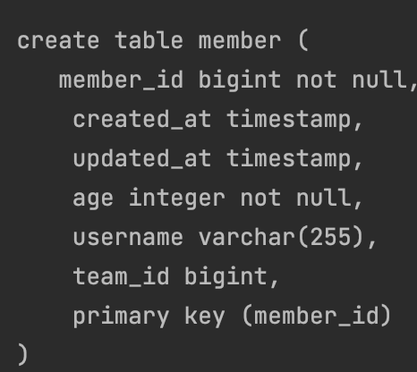
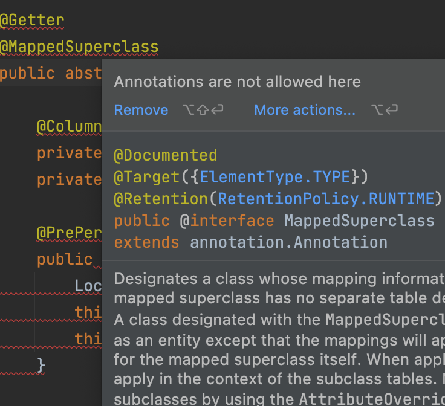
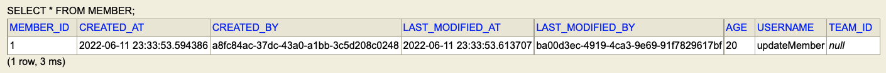

# 확장 기능

</br>

## 사용자 정의리포지토리 구현

</br>

- 스프링 데이터 JPA 리포지토리는 인터페이스만 정의하고 구현체는 스프링이 자동 생성
- 스프링 데이터 JPA가 제공하는 인터페이스를 직접 구현하면 구현해야 하는 기능이 너무 많음
- 다양한 이유로 인터페이스의 메서드를 직접 구현하고 싶다면?
  - JPA 직접 사용( EntityManager )
  - 스프링 JDBC Template 사용
  - MyBatis 사용
  - 데이터베이스 커넥션 직접 사용 등등...
  - Querydsl 사용

</br>

- 사용자 정의 인터페이스를 만들기

- 1. 인터페이스 만들기

```java
public interface MemberRepositoryCustom {

    List<Member> findMemberCustom();
}
```

- 2. 구현체 만들기

```java

@RequiredArgsConstructor
public class MemberRepositoryImpl implements MemberRepositoryCustom {

    private final EntityManager em;

    @Override
    public List<Member> findMemberCustom() {
        return em.createQuery("select  m from Member m")
                .getResultList();
    }
}

```

- 3. MemberRepository에서 상속 받기

```java
public interface MemberRepository extends JpaRepository<Member, Long>, MemberRepositoryCustom
```

</br>

## Auditing

</br>

- 순수 JPA에서 사용

</br>

```java

@Getter
@MappedSuperclass
public class JpaBaseEntity {

    @Column(updatable = false)
    private LocalDateTime createdAt;
    private LocalDateTime updatedAt;

    @PrePersist
    public void prePersist(){
        LocalDateTime now = LocalDateTime.now();
        this.createdAt = now;
        this.updatedAt = now;
    }

    @PreUpdate
    public void preUpdate(){
        this.updatedAt = LocalDateTime.now();
    }
}
```

```java
public class Member extends JpaBaseEntity
```

> 이런식으로 BaseEntity를 만들고 Entity가 상속 받으면  
> 해당 컬럼을 사용할 수 있다.

</br>

|               DDL 결과                |
| :-----------------------------------: |
|  |

</br>

> @MappedSuperClass는 그냥 속성만 내려서 쓰는 관계지 실제 상속관계가 아니다.  
> 이를 증명하는게 실제 구현할 일이 없어서 class 정의를 abstract으로 변경하였더니

</br>

|             abstract를 허용하지 않음              |
| :-----------------------------------------------: |
|  |

</br>

- Spring Data JPA

- 1. Application에 어노테이션 달아주기

```java
@SpringBootApplication
@EnableJpaAuditing
```

```java
@MappedSuperclass
@EntityListeners(AuditingEntityListener.class)
@Getter
public class BaseEntity{

    @CreatedDate
    @Column(updatable = false)
    private LocalDateTime createdAt;

    @LastModifiedDate
    private LocalDateTime lastModifiedAt;

    @CreatedBy
    @Column(updatable = false)
    private String createdBy;

    @LastModifiedBy
    private String lastModifiedBy;
}
```

</br>

- 임시 AuditingProvider

```java
@SpringBootApplication
@EnableJpaAuditing
public class DataJpaApplication {

    public static void main(String[] args) {
        SpringApplication.run(DataJpaApplication.class, args);
    }

    @Bean
    public AuditorAware<String> auditorProvider(){
        return () -> Optional.of(UUID.randomUUID().toString());
    }
}
```

> UUID로 createdBy와 UpdatedBy 넣어주기

</br>

|                    저장 결과                    |
| :---------------------------------------------: |
|  |

</br>

## Web 확장 - 도메인 클래스 컨버터

</br>

> 이 기능은 그냥 듣고 넘겼다..
> Presentation Layer에서 PK로 Entity를 잡아서 행위를 한다?  
> 말도 안된다... 굳이 꺼낼 필요도 없고  
> Application Layer에서 사용해야하는 것이 바람직하다.

</br>

## Web 확장 - 페이징과 정렬

```java
    @GetMapping("members")
    public Page<Member> list(Pageable pageable){
        return memberRepository.findAll(pageable);
    }
```

```java
@NoRepositoryBean
public interface PagingAndSortingRepository<T, ID> extends CrudRepository<T, ID> {

	/**
	 * Returns all entities sorted by the given options.
	 *
	 * @param sort the {@link Sort} specification to sort the results by, can be {@link Sort#unsorted()}, must not be
	 *          {@literal null}.
	 * @return all entities sorted by the given options
	 */
	Iterable<T> findAll(Sort sort);

	/**
	 * Returns a {@link Page} of entities meeting the paging restriction provided in the {@link Pageable} object.
	 *
	 * @param pageable the pageable to request a paged result, can be {@link Pageable#unpaged()}, must not be
	 *          {@literal null}.
	 * @return a page of entities
	 */
	Page<T> findAll(Pageable pageable);
}

```

</br>

> PagingAndSortingRepository에서  
> findAll의 인자로 Pagealbe 인터페이스를 허용한다.

</br>

```uri
http://localhost:8080/members?page=1&size=12&sort=id,desc&sort=username,desc
```

> 쿼리 파라미터로 page와 size를 허용한다.

</br>

- page = 1 size = 12 그리고 member가 100개 있다고 하면

</br>

- id 88~77인 member 보내고
- 첫번째 페이지는 아니고
- 마지막 페이지도 아니고
- 현재 page size는 12고
- total page는 100 / 12 + 1임으로 9일 것이고(`안나눠 떨어짐`)

</br>

- pageable 반환

```json
    "pageable": {
        "sort": {
            "sorted": true,
            "unsorted": false,
            "empty": false
        },
        "pageNumber": 1,
        "pageSize": 12,
        "offset": 12,
        "paged": true,
        "unpaged": false
    },
    "totalPages": 9,
    "totalElements": 100,
    "last": false,
    "first": false,
    "numberOfElements": 12,
    "size": 12,
    "number": 1,
    "sort": {
        "sorted": true,
        "unsorted": false,
        "empty": false
    },
    "empty": false
```

</br>

- global page

```yml
data:
  web:
    pageable:
      default-page-size: 10
      max-page-size: 2000
```

- @PageableDefault

```java
package org.springframework.data.web;

import java.lang.annotation.Documented;
import java.lang.annotation.ElementType;
import java.lang.annotation.Retention;
import java.lang.annotation.RetentionPolicy;
import java.lang.annotation.Target;

import org.springframework.data.domain.Sort.Direction;
import org.springframework.data.web.SortDefault.SortDefaults;

/**
 * Annotation to set defaults when injecting a {@link org.springframework.data.domain.Pageable} into a controller
 * method. Instead of configuring {@link #sort()} and {@link #direction()} you can also use {@link SortDefault} or
 * {@link SortDefaults}.
 *
 * @since 1.6
 * @author Oliver Gierke
 */
@Documented
@Retention(RetentionPolicy.RUNTIME)
@Target(ElementType.PARAMETER)
public @interface PageableDefault {

	/**
	 * Alias for {@link #size()}. Prefer to use the {@link #size()} method as it makes the annotation declaration more
	 * expressive and you'll probably want to configure the {@link #page()} anyway.
	 *
	 * @return
	 */
	int value() default 10;

	/**
	 * The default-size the injected {@link org.springframework.data.domain.Pageable} should get if no corresponding
	 * parameter defined in request (default is 10).
	 */
	int size() default 10;

	/**
	 * The default-pagenumber the injected {@link org.springframework.data.domain.Pageable} should get if no corresponding
	 * parameter defined in request (default is 0).
	 */
	int page() default 0;

	/**
	 * The properties to sort by by default. If unset, no sorting will be applied at all.
	 *
	 * @return
	 */
	String[] sort() default {};

	/**
	 * The direction to sort by. Defaults to {@link Direction#ASC}.
	 *
	 * @return
	 */
	Direction direction() default Direction.ASC;
}

```

```java
@PageableDefault(size = 5, sort = "username")
```

</br>

> 이런식으로 사용할 수도 있다.

</br>
