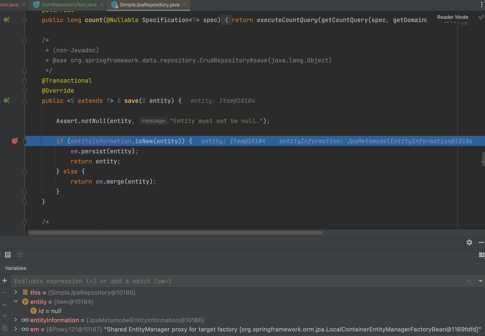
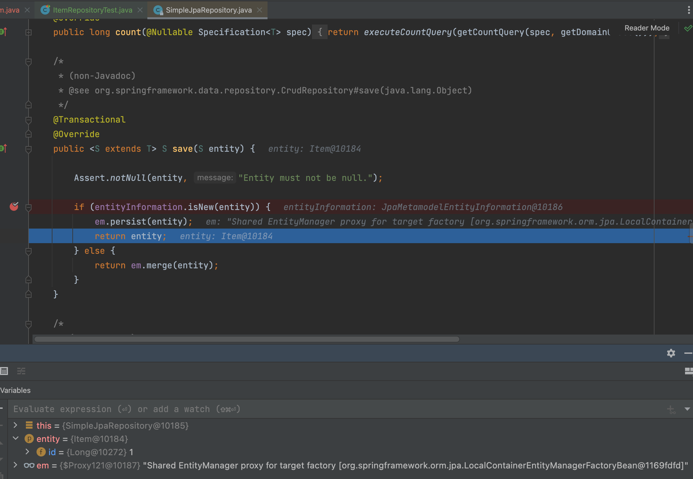
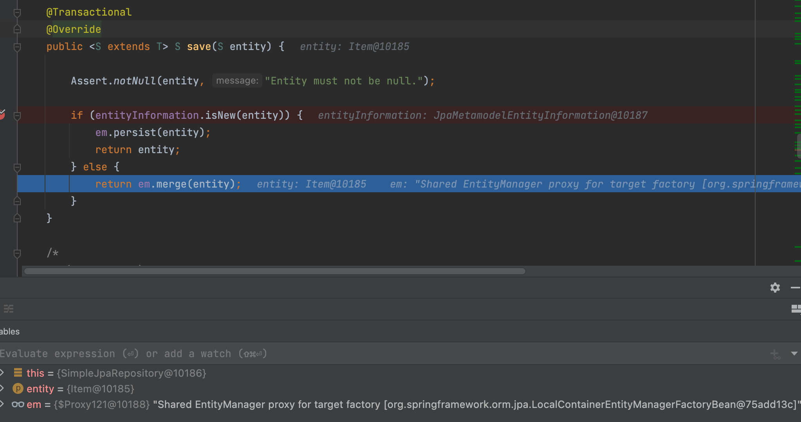
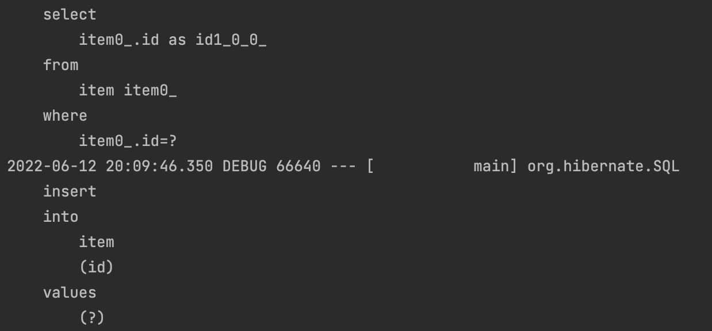

# 스프링 데이터 JPA 분석

</br>

## 스프링 데이터 JPA 구현체 분석

</br>

- org.springframework.data.jpa.repository.support.SimpleJpaRespository

</br>

> 우리가 흔히 JPARespository를 상속받아 정의하곤 하는데,  
> 실질적 공통 인터페이스의 구현체가 SimpleJpaRepository다.

</br>

```java
/**
 * Default implementation of the {@link org.springframework.data.repository.CrudRepository} interface. This will offer
 * you a more sophisticated interface than the plain {@link EntityManager} .
 *
 * @param <T> the type of the entity to handle
 * @param <ID> the type of the entity's identifier
 * @author Oliver Gierke
 * @author Eberhard Wolff
 * @author Thomas Darimont
 * @author Mark Paluch
 * @author Christoph Strobl
 * @author Stefan Fussenegger
 * @author Jens Schauder
 * @author David Madden
 * @author Moritz Becker
 * @author Sander Krabbenborg
 * @author Jesse Wouters
 * @author Greg Turnquist
 * @author Yanming Zhou
 * @author Ernst-Jan van der Laan
 * @author Diego Krupitza
 */
@Repository
@Transactional(readOnly = true)
public class SimpleJpaRepository<T, ID> implements JpaRepositoryImplementation<T, ID>

```

</br>

> 간략히 읽어보면,  
> CrudRepository에 인터페이스에 대한 기본 구현체이고,  
> 이것이 EntityManager보다 더 정교한 인터페이스를 제공해줄 것이라고 설명한다.

</br>

- @Repository
  - 스프링 컴포넌트 스캔에 대상이되는 bean
  - JPA나 JDBC에서 발생하는 예외를 스프링 프레임워크에서 발생하는 exception으로 변경
    - 하부 기술을 JDBC을 JPA로 바꿔도 exception을 처리하는 메커니즘이 동일하다.
      - 하부 구현기술을 바꿔도 순수 비즈니스 로직이 바뀌지 않도록 설계가 잘 돼있다.

</br>

```java
	@Transactional
	@Override
	public <S extends T> S save(S entity) {

		Assert.notNull(entity, "Entity must not be null.");

		if (entityInformation.isNew(entity)) {
			em.persist(entity);
			return entity;
		} else {
			return em.merge(entity);
		}
	}
```

</br>

- save() 메서드
  - entity 정보가 없으면 persist
  - 정보가 존재하면 merge

</br>

> save 메서드는 기본 class 단위에서 Transactional(readOnly = true)가 아닌  
> 쓰기임으로 @Transactional을 붙인 것.

</br>

- @Transactional
  - JPA의 모든 변경은 트랜잭션 안에서 동작
  - 스프링 데이터 JPA는 변경(등록, 수정, 삭제) 메서드를 트랜잭션 처리
  - 서비스 계층에서 트랜잭션을 시작하면 레포지토리는 해당 트랜잭션을 전파 받아서 사용
  - 그래서 스프링 데이터 JPA를 사용할 때 트랜잭션이 없어도 데이터 등록, 변경이 가능

</br>

- @Transactional(readOnly = true)
  - readOnly = true 옵션 사용을 플러시 생략해서 약간의 성능 향상 기대

</br>

## 새로운 엔티티를 구별하는 방법

</br>

- save() 메서드
  - entity 정보가 없으면 persist
  - 정보가 존재하면 merge

</br>

- 새로운 엔티티를 판단하는 기본 전략
  - 식별자가 객체일 때 null로 판단
  - 식별자가 primitive일 때 0으로 판단
  - Persistable 인터페이스르 구현해서 판단 로직 변경 가능

</br>

- Persistable

```java
package org.springframework.data.domain;

import org.springframework.lang.Nullable;

/**
 * Simple interface for entities.
 * <p>
 * Note that methods declared in this interface ({@link #getId()} and {@link #isNew()}) become property accessors when
 * implementing this interface in combination with
 * {@link org.springframework.data.annotation.AccessType @AccessType(PROPERTY)}. Either of these can be marked as
 * transient when annotated with {@link org.springframework.data.annotation.Transient @Transient}.
 *
 * @param <ID> the type of the identifier
 * @author Oliver Gierke
 * @author Christoph Strobl
 * @author Mark Paluch
 */
public interface Persistable<ID> {

	/**
	 * Returns the id of the entity.
	 *
	 * @return the id. Can be {@literal null}.
	 */
	@Nullable
	ID getId();

	/**
	 * Returns if the {@code Persistable} is new or was persisted already.
	 *
	 * @return if {@literal true} the object is new.
	 */
	boolean isNew();
}
```

</br>

- JPA 식별자 생성 전략인 @GenerateValue면 save() 호출 시점에 식별자가 없으므로 새로운 엔티티로 인식해서 정상 동작한다.
- JPA 식별자 생성전략이 @Id만 사용해서 직접 할당이면 이미 식별자 값이 있는 상태로 save() 메서드 호출
  - 따라서 이경우에는 merge()가 호출
- `merge()는 비효율적`
  - `우선 DB 값을 호출해서 값을 확인하고, DB에 값이 없으면 새로운 엔티티로 인지하기 때문!`
  - 따라서 Persistable을 상속하여 새로운 엔티티 확인 여부를 직접 구현하는 것이 효과적
  - @CreateDate를 조합해서 사용하면 이 필드로 새로운 엔티티 여부를 편리하게 확인 가능
    - @CreateDate에 값이 없으면 새로운 엔티티로 판단.

</br>

```java
@Entity
public class Item {

    @Id
    @GeneratedValue
    private Long id;
}

```

</br>

- 생성시 @Id값은 null
- @GeneratedValue는 persist하는 시점에 Id값이 결정된다.

</br>

```java
	@Transactional
	@Override
	public <S extends T> S save(S entity) {

		Assert.notNull(entity, "Entity must not be null.");

		if (entityInformation.isNew(entity)) {
			em.persist(entity);
			return entity;
		} else {
			return em.merge(entity);
		}
	}
```

|                     디버깅                     |
| :--------------------------------------------: |
|  |

> save 메서드 호출하면 Id가 null임으로  
> 새로운 Entity로 인지하여 em.persist()가 동작한다.

</br>

|               디버깅 id not null                |
| :---------------------------------------------: |
|  |

</br>

> 이후 persist가 동작하여 DB에서 @Id값을 결정할 수 있다.  
> 영속성 컨텍스트 안에서도 이제 현재 id가 유지된다.

</br>

```java
@Entity
@NoArgsConstructor(access = AccessLevel.PROTECTED)
public class Item {

    @Id
    private String id;

    public Item(String id){
        this.id = id;
    }
}
```

</br>

```java
    @Test
    public void save(){
        Item item = new Item("A");
        itemRepository.save(item);
    }
```

</br>

> 이 경우 식별자가 Null이 아니기 때문에,  
> 새로운 객체로 엔티티로 인식되는 것이 아니어서  
> persist가 아닌 merge가 호출 된다.

</br>

|                   merge 호출                   |
| :--------------------------------------------: |
|  |

</br>

|              merge 콘솔              |
| :----------------------------------: |
|  |

</br>

> 이렇게 merge가 호출 될 경우  
> select 쿼리가 한 번 호출됨으로  
> 성능상 비효울적이다.

</br>

- 거의 그럴 일은 없지만, 대리키 전략이 아닐 경우!
  - 실제 `식별자 생성 전략을 사용하지 못할 경우!`

```java

@Entity
@NoArgsConstructor(access = AccessLevel.PROTECTED)
public class Item extends BaseEntity implements Persistable<String> {

    @Id
    private String id;

    public Item(String id){
        this.id = id;
    }

    @Override
    public String getId() {
        return this.id;
    }

    @Override
    public boolean isNew() {
        return getCreatedAt() == null;
    }
}

```

- BaseEntity에 있는 CreatedAt을 통해서 새로운 Entity인지 판단한다.
- 이 경우 isNew를 오버라이드 해서 사용자가 새로운 엔티티인지 판단 여부를 주기 때문에, merge가 아닌 persist가 호출 된다
  - `select 쿼리가 나가지 않는다!`
