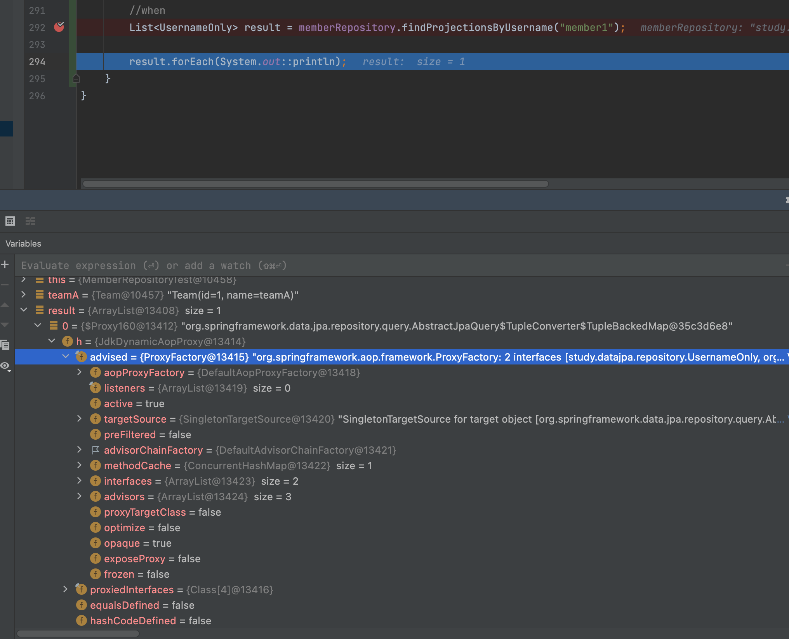
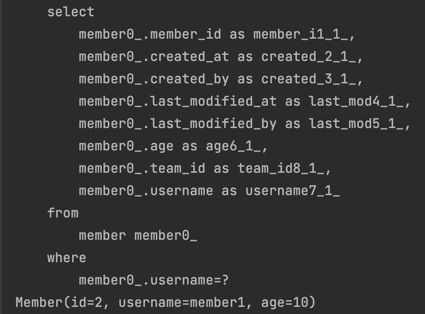

# 나머지 기능들

</br>

## Specifications(명세)

</br>

- 쓰지마세여..?

</br>

- DDD에서 Specification이라는 개념을 소개
- 스프링 데이터 JPA는 JPA Criteria를 활용해서 이 개념을 사용할 수 있도록 지원

</br>

- Predicate

  - 참 또는 거짓으로 평가
  - AND OR 같은 연산자로 조합해서 다양한 검색 조건을 쉽게 생성(컴포지트 패턴)
  - 검색 조건 하나하나
  - 스프링 데이터 jpasms org,springframework.data.jpa.domain.Specification 클래스로 정의

- 명세 기능 사용 방법
  - JpaSpecificationExecutor 인터페이스 상속

```java
Specification<Member> spec =
  MemberSpec.username("m1").and(MemberSpec.teamName("teamA"));
      List<Member> result = memberRepository.findAll(spec);
```

</br>

> 이런식으로 조회한다...

- 명세를 정의하려면 Specification 인터페이스를 구현
- 명세를 정의할 때는 toPredicate(...)메서드만 구현하면 되는데 JPA Criteria의 Root, CriteriaQuery, CriteriaBuilder 클래스를 파라미터 제공
- `그냥 QueryDSL을 사용하자.`
  - Criteria가 너무 복잡하다...
    - 우선 기존에 레포지토리에 상속을 받고, spec을 추가하는 건데, 그렇다고 성능 및 가독성에서 엄청나게 이점이 있는 기능은 아닌 것같다.

</br>

## Query By Example

</br>

- 장점
  - 동적 쿼리를 편하게 처리
  - 도메인 객체를 그대로 사용
  - 데이터 저장소를 RDB에서 NoSQL로 변경해도 코드 변경이 없게 추상화 되어 있음
  - 스프링 데이터 JPA JpaRepository 인터페이스에 이미 포함
- 단점

  - 조인은 가능하지만 내부 조인만 가능함 외부조인 안됨
  - 다음과 같은 중첩 제약 조건 안됨
    - firstname =?0 or (firstname =?1 and lastname =?2)
  - 매칭 조건이 단순함
    - 문자는 starts/contains/ends/regex
    - 다른 속성은 정확한 매칭(=)만 지원

- 정리
  - 실무에서 사용하기에는 매친 조건이 너무 단순하고, `LEFT 조인이 안된다.`

</br>

## Projections

</br>

```java
public interface UsernameOnly {
    String getUsername();
}

```

```java
   List<UsernameOnly> findProjectionsByUsername(@Param("username") String username);
```

```java
    @Test
    public void projections(){
        Team teamA = new Team("teamA");

        teamRepository.save(teamA);

        memberRepository.save(new Member("member1", 10, teamA));
        memberRepository.save(new Member("member2", 20, teamA));

        em.flush();
        em.clear();

        //when
        List<UsernameOnly> result = memberRepository.findProjectionsByUsername("member1");

        result.forEach(System.out::println);
    }
```

|디버깅 결과|
||

</br>

> 인터페이스를 정의하면 구현체는 스프링데이터 jpa가 프록시 기술을 통해서 가짜를 만들어준다.

</br>

- open projections

```java
public interface UsernameOnly {

    @Value("#{target.username + ' ' + target.age + ' ' + target.team.name}")
    String getUsername();
}
```

|open proejections|
||

> 실제 데이터를 select 쿼리를 날려 바로 가져오는 것

- 프로젝션 대상이 root 엔티티면, JPQL SELECT 절 최적화 가능
- 프로젝션 대상이 ROOT가 아니면

  - LEFT OUTER JOIN 처리
  - 모든 필드를 SELECT해서 엔티티로 조회한 다음에 계산

- 정리
  - 프로젝션 대상이 root 엔티티면 유용
  - 프로젝션 대상이 root 엔티티를 넘어가면 JPQL SELECT 최적화가 안된다!
  - 실무의 복잡한 쿼리를 해결하기에는 한계가 있다.
  - 실무에서는 단순할 때만 사용하고, 조금만 복잡해지면 QueryDSL을 사용하자...

</br>

- Class 타입 : Dto

```java
public class UsernameOnlyDto {

    private final String username;

    // 생성자의 파라미터 이름으로 매칭
    public UsernameOnlyDto(String username) {
        this.username = username;
    }

    public String getUsername() {
        return username;
    }
}

```

</br>

- 동적 Projections

```java
 <T> List<T> findProjectionsByUsername(String username, Class<T> type);
```

- 중첩 구조 처리

```java

public interface NestedClosedProjection {
      String getUsername();
      TeamInfo getTeam();

      interface TeamInfo {
          String getName();
      }
}
```

```console
select
      m.username as col_0_0_,
      t.teamid as col_1_0_,
      t.teamid as teamid1_2_,
      t.name as name2_2_
from
member m
  left outer join
      team t
          on m.teamid=t.teamid
where
      m.username=?
```

> 첫번째 멤버는 최적화가 된다.  
> 하지만 두 번째 불러오는 객체에서는 최적화가 이뤄지지 않고  
> 모두 불러온다.

## 네이티브 쿼리

</br>

- 가급적 네이티브 쿼리는 사용하지 않는게 좋고, 어쩔 수 없을 때 사용
- 차선은 최근에 나온 스프링 데이터 Projections 사용

</br>

- 페이징 지원
- 반환 타입
  - Object[]
  - Tuple
  - DTO(스프링 데이터 인터페이스 Projections 지원)
- 제약
  - Sort 파라미터를 통한 정렬이 정상 동작하지 않을 수 있음(`믿지 말고 직접 처리`)
  - JPQL처럼 `애플리케이션 로딩 시점에 문법 확인 불가`
  - 동적 쿼리 불가

</br>

```java
@Query(value = "select * from member where username = ?", nativeQuery = true)
      Member findByNativeQuery(String username);
```

> JDBC 써봤을 때 알다싶이, 이런식으로 Native 날려봤자  
> JPA 장점도 못살리고 제약사항도 너무 많다.  
> `이럴 경우 JDBC나 MyBatis를 쓰는 것을 권장`

</br>

- Projections 활용

</br>

```java
    // 스프링 데이터 JPA 네이티브 쿼리 + 인터페이스 기반 Proejctions 활용
    @Query(value = "SELECT m.member_id as id, m.username, t.name as teamName " +
            "FROM member m left join team t",
            countQuery = "SELECT count(*) from member",
            nativeQuery = true)
    Page<MemberProjection> findByNativeProjection(Pageable pageable);
```
